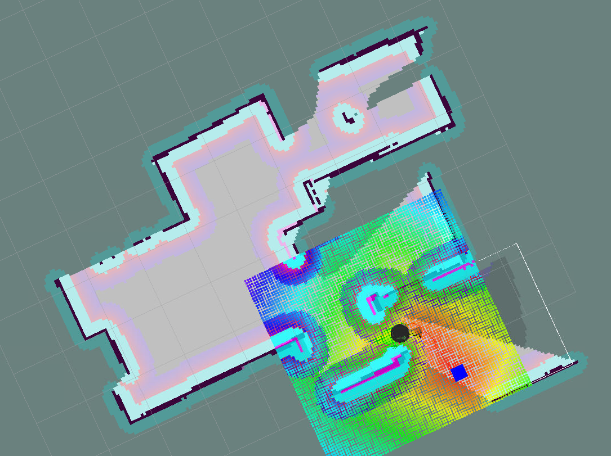
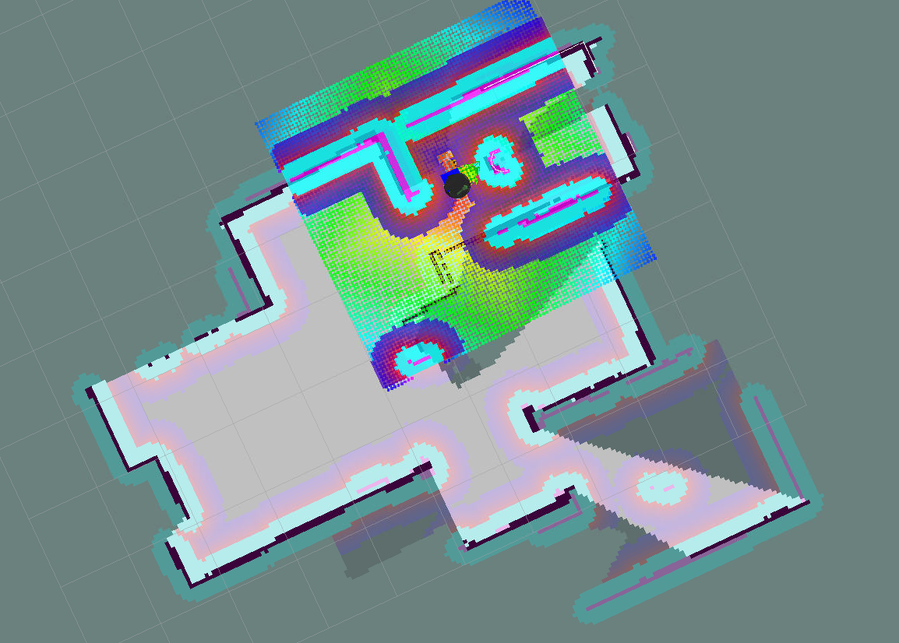

# Home Service Robot (turtlebot)

> This is proof of concept of a delivery robot. It is able to pick up/drop off a "simulated" package in a virtual environment.

This project simulates a home service robot. The robot picks up a simulated package in a virtual environment and then drops it in another location. 

This project uses turtlebot as the robot, it simulates an environment in gazebo, and is able to pick/drop the package as a marker in rviz.

## Requirements
Unfortunately, this  project requires old versions of ROS and [therefore] old versions of Ubuntu:

* Ubuntu 16.04
* ROS Kinetic Kame
* xterm

## How to run

1. Clone this package to your ``<ROS_workspace/src>``
2. Compile:
```sh
catkin_make 
```
3. Source environment
```sh
source devel/setup.bash
```
4. Run home_service.
```sh
./src/home_service_robot/scripts/home_service.sh
```
This last step will load gazebo with the environment found [here](https://github.com/lemontyc/my_robot). It will load the first generation of the turtlebot, start AMCL localization, start RVIZ with everythin ready to visualize trajectory, and will trigger nodes ``pick_objects`` and ``add_markers``. 

This will make the turtlebot move to the lower right room to pick up the blue box:



And after 5 seconds it will move to the upper right room to deliver the blue box:



## Other scripts
There are other scripts that allow to test functionality individually. All of them are located at ``scripts``:

Script  | Loads Gazebo world | Runs gmapping | Runs amcl | Loads RVIZ cfg | Adds markers | Picks objects
--------  | -------- | -------- | -------- | -------- | -------- | -------- 
test_slam.sh |  X | X
test_navigation.sh | X | | X | X 
pick_objects.sh | X | | X | X | | X 
add_marker.sh | X | | X | X | X 
home_service.sh | X | | X | X | X | X

# Meta
Luis M. (@lemontyc)

Distriuted under the MIT License. See ``LICENSE`` for more information.

[lemontyc@GitHub](https://github.com/lemontyc)

This was the last project required to graduate the ``Udacity Robotics Software Engineer Nanodegree (2020)`` program.
